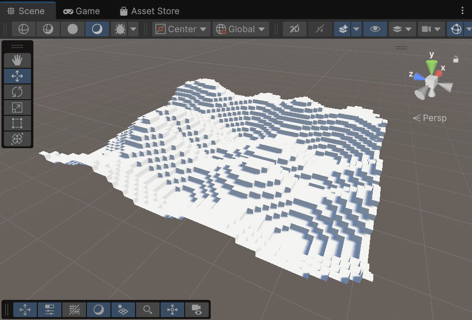
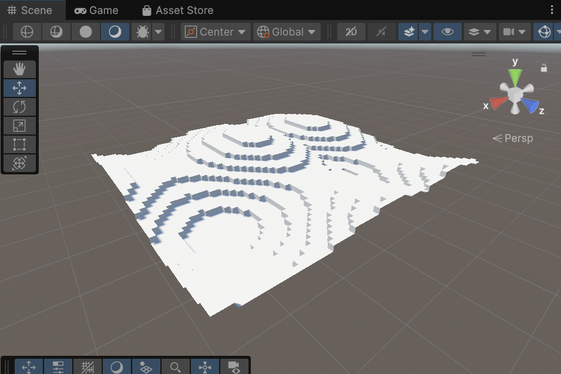
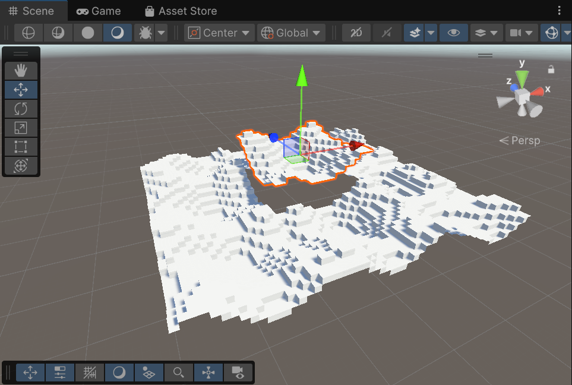

# Minecraft Terrain Generator

A 3D procedural chunk-based terrain generator built from scratch in Unity using C#. 

Instead of using pre-built Unity terrain assets, this project replicates the discrete, block-based generation of Minecraft. It focuses on low-level graphics programming by mathematically generating the world using noise algorithms and drawing the optimized meshes entirely via code.

### Core Mechanics & Technical Features
* **Chunk-Based Architecture:** The world is divided into manageable grids (Chunks) to handle memory and rendering efficiently, exactly like Minecraft's underlying system.
* **Perlin Noise Heightmaps:** Utilized mathematically generated 2D Perlin noise to create organic, randomized peaks and valleys for the terrain structure.
* **Dynamic Voxel Meshing (Face Culling):** The engine mathematically checks neighboring block coordinates and *only* renders the faces exposed to the air, preventing the GPU from drawing thousands of hidden internal polygons.
* **Manual Mesh Generation:** Bypassed standard 3D modeling by procedurally calculating all vertex coordinates and connecting triangle arrays in real-time via C# scripts.

### Why This Was Built
This project was developed to understand the low-level mechanics of voxel game engines, specifically how physical objects are rendered on screen using raw math, coordinates, and procedural algorithms.
